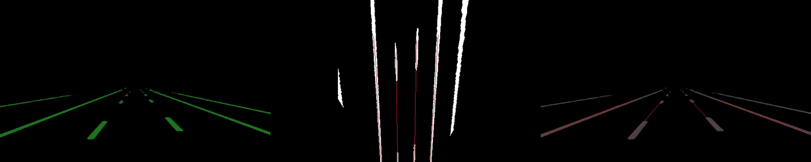
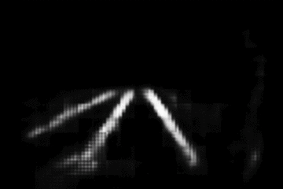

# VPGNet Usage and Lane Detection

Rui Wang @ Tsinghua University

This project is implements lane detection algorithms, with the neural net model forked from [VPGNet](https://github.com/SeokjuLee/VPGNet). Also check out [caltech lane detection repo](https://github.com/mohamedadaly/caltech-lane-detection).

Real-time lane detection effect:



Lane detection for HD Map. From left to right: output from neural net, lane detection (marked in red lines) in bird's eye view, lane detection (marked in red lines) in driver's perspective.

Output from neural network:



## Overview
This project modified the VPGNet implementation, with a focus on lane detection. It also made use of and modified the __inverse perspective mapping__ (IPM) from caltech lane detection.

This project aims to develop a clearer document for VPGNet usage, providing a clean interface for lane detection. Hopefully with this document you'll be able to __actually__ run VPGNet without too much pain. It also implements some of the post-processing techniques that are not provided in the original repo. Please check out their original repo referenced above, and cite their paper if it helped your research.

Please see it running in **Usage** section. Apart from the workflow as a whole, it also provides standalone post-processing modules for pictures. You may find some of the implementations here useful, including IPM and lane clustering.

## Installation
The entire repo is tested on Ubuntu 16.04. For other OS, you may need additional information or implement your own modification to make it work. As a quick notice, some of the major dependencies include python, caffe and opencv.

Note that the installation process might be extremely painful without prior experience with Ubuntu and these open source libraries. Nevertheless, I will try to make the tutorial as clear as possible.

## Usage
The package contains two standalone parts that processes MultiNet(dashed line output) and VPGNet(connected line output), respectively. Before usage and modification, there are several points worth noting:

*	The post-processing for dashed lines and connected lines are different.
*	Both programs are optimized for speed, but MultiNet post processing takes much longer time due to performance concerns.
*	If you are using a neural network, it is always recommended to output connected lines instead of dashed lines - otherwise you are not taking advantage of neural network. Neural networks are designed such that complicated tasks can be solved. Simply outputting dashed lines means you are almost only making use of
*	pixel color as the determining factor, and still leave a complicated problem for post-processing since it is very hard to achieve a good result by traditional computer vision algorithms on dashed line extraction, especially when noises are present.
*	Of course, it would be great if you are designing a neural network that yields a highly abstract output instead of an image/matrix. That would save a ton of time, and even eliminate the demand for this post-processing module all along.
*	Please test the project on given examples before proceeding - you should understand that this program is not panacea and cannot work for any picture. You will need to customize the many parameters used in this program according to the style of your input. Sometimes, when the input is very different, e.g. the noises are
*	heavier than what is present in the examples, you will need to introduce additional processing or modify the algorithm. The algorithms are explained detailedly in this wikipage so you can get a grasp of what it is trying to do.
*	It is highly encouraged to read the source code. The code is well-documented with comments. The various parameters introduced below would make much more sense in code.

All usages in this section are under directory VPGNet/caltech-lanes-dataset/caltech-lane-detection/src

To compile just for IPM, run
```
g++ IPM.cpp InversePerspectiveMapping.cc mcv.cc -o a `pkg-config --libs opencv`
```
This will generate an executable `a`.
Name the picture you want to perform IPM on `input.png`, first resize it (optional, depending on your `camera.conf` file and picture size) using `resize.py` and then run `./a` will give you the output in `output.png`.

To compile for entire post-processing, run 
`source swig.sh`

This generates the C++-Python interface and allows python to directly call IPM functions. To run this, make sure swig is properly installed on your computer.
(The config file for swig is `IPM.i`, `adjust_line.i`, and `adjust_line_for_VPG.i`)

If you want to run post-processing for dashed lines (example input pictures are in VPGNet/caltech-lanes-dataset/caltech-lane-detection/src/unity/index.png, can be any size)
```python lane_extension_polyline_for_Multinet.py <filename> -a -o -d <directory>```

__**Exemplary Run:**__
```
python lane_extension_polyline_for_Multinet.py unity/1.png -a -o -d output_log
```
This will generate all the results under directory `output_log`.

The flags `-a`, `-o` and `-d` are optional.
`-a`: whether you want to do line refining adjustment or not. (read the section Algorithm Explained first and you will understand)
`-o`: whether you want output or not. If you want to test the running time, you should suppress output of results as they consume a lot of additional time, so use this flag.
`-d <directory>`: where you want your output to be stored. Use this flag with -o flag. Your results, in the form of png pictures, will be stored under that directory

If you want to run post-processing for connected lines(example input picture is in VPGNet/caltech-lanes-dataset/caltech-lane-detection/src/list, can be any size)

__**Exemplary Run:**__
```
python lane_extension_polyline_for_VPG.py list/input.png -a -o -d output_log
```

If you want to run the entire pipeline for a real-life picture (examples are in `../../cordova1, codova2, washington2`), notice that `washington1` was not used as it was too different from other datasets.

__**Exemplary Run:**__
```
python lane_detection_workflow.py
```
This will run on a batch of files in `../../cordova1, codova2, washington2`   (`cordova1` by default, but you can change to other datasets.)
The results are stored in `VPG_log/labeled`.

## Speed Performance
In order to achieve fast performance, I spent a lot of time optimizing the code.
I truncated the original version of VPGNet and customized it for our needs. The resulted network runs at ~68Hz.
I rewrote the most time-consuming part of the project in C++ and used swig for the interface between python and C++.
Also, I optimized the code in IPM (inverse perspective mapping) and reduced redundancy in code to the largest extent.
The final algorithm runs at 48Hz on an NVIDIA 1070Ti and Intel i5 desktop, which is state-of-the-art result as of September 2018.

## Training
## Data Augmentation
## Test


## Inverse Perspective Mapping
There is also a standalone implementation of inverse perspective mapping. Go to `caltech_lanes_dataset/caltech_lane_detection/src/`, and compile it (this is to compile only the IPM, not the entire caltech project!) with
~~~
g++ IPM.cpp InversePerspectiveMapping.cc mcv.cc -o a `pkg-config --libs opencv`
~~~
Here `a` is the executable file. Save the image you want to perform IPM as `input.png` under the same directory, and run `./a`. Now follow any prompts in your command line window. The result will be saved as `output.png`. An example is already included in the folder.

Note, that you will need to change the camera configuration if you are not using caltech lane dataset. The parameters can be set in `IPM.cpp`, whereafter you will have to recompile before running. You should be able to navigate through and modify the project for yourself with **Sublime Text 3** or equivalent editors (as long as it can link the function definition and/or reference).

## Post Processing
The post-processing for this project poses the greatest challenge. From the output (pixelwise) of neural network to a mathematical form of polylines, tons of work is required. I use houghlines algorithm, clustering algorithm, inverse perspective mapping (IPM), and a lot of filteing and adjustment to obtain the final results.

## ::::::::::::::::  Supplementary Information ::::::::::::::::::
**Below is the original readme file from VPGNet:**
## [VPGNet: Vanishing Point Guided Network for Lane and Road Marking Detection and Recognition]

International Conference on Computer Vision (ICCV) 2017


In this paper, we propose a unified end-to-end trainable multi-task network that jointly handles lane and road marking detection and recognition that is guided by a vanishing point under adverse weather conditions. We tackle rainy and low illumination conditions, which have not been extensively studied until now due to clear challenges. For example, images taken under rainy days are subject to low illumination, while wet roads cause light reflection and distort the appearance of lane and road markings. At night, color distortion occurs under limited illumination. As a result, no benchmark dataset exists and only a few developed algorithms work under poor weather conditions. To address this shortcoming, we build up a lane and road marking benchmark which consists of about 20,000 images with 17 lane and road marking classes under four different scenarios: no rain, rain, heavy rain, and night. We train and evaluate several versions of the proposed multi-task network and validate the importance of each task. The resulting approach, VPGNet, can detect and classify lanes and road markings, and predict a vanishing point with a single forward pass. Experimental results show that our approach achieves high accuracy and robustness under various conditions in real-time (20 fps). The benchmark and the VPGNet model will be publicly available.


### Supplementary
+ https://www.youtube.com/watch?v=jnewRlt6UbI


### Citation
Please cite [VPGNet](http://openaccess.thecvf.com/content_iccv_2017/html/Lee_VPGNet_Vanishing_Point_ICCV_2017_paper.html) in your publications if it helps your research:

    @InProceedings{Lee_2017_ICCV,
      author = {Lee, Seokju and Kim, Junsik and Shin Yoon, Jae and Shin, Seunghak and Bailo, Oleksandr and Kim, Namil and Lee, Tae-Hee and Seok Hong, Hyun and Han, Seung-Hoon and So Kweon, In},
      title = {VPGNet: Vanishing Point Guided Network for Lane and Road Marking Detection and Recognition},
      booktitle = {The IEEE International Conference on Computer Vision (ICCV)},
      month = {Oct},
      year = {2017}
    }


### Baseline Usage
1) Clone the repository

    ```Shell
    git clone https://github.com/SeokjuLee/VPGNet.git
    ```

2. Prepare dataset from Caltech Lanes Dataset.<br/>
(Our dataset is currently being reviewed by Samsung Research. This baseline doesn't need VP annotations.)
    - Download [Caltech Lanes Dataset](http://www.mohamedaly.info/datasets/caltech-lanes).
    - Organize the file structure as below.
    ```Shell
    |__ VPGNet
        |__ caffe
        |__ caltech-lanes-dataset
            |__ caltech-lane-detection/matlab
            |__ cordova1
            |__ cordova2
            |__ washington1
            |__ washington2
            |__ vpg_annot_v1.m
    ```
    - Generate list files using 'caltech-lanes-dataset/vpg_annot_v1.m'. Arrange training and validation sets as you wish.

3. Caffe compliation
    - Compile our Caffe codes following the [instructions](http://caffe.berkeleyvision.org/installation.html).
    - Move to 'caffe/models/vpgnet-novp'. This is our workspace.

4. Make LMDB
    - Change paths in 'make_lmdb.sh' and run it. The LMDB files would be created.

5. Training
    - Run 'train.sh'


### Dataset Contact
+ All rights about the dataset are preserved by Samsung Electronics Co.
+ Please contact [Tae-Hee Lee](mailto:th810.lee@samsung.com), [Hyun Seok Hong](mailto:hyunseok76.hong@samsung.com), and [Seung-Hoon Han](mailto:luoes.han@samsung.com) with questions and comments.


### Log
+ Sep.11.2017: The "VPGNet" pages beta test
+ Dec.18.2017: Caffe codes uploaded
